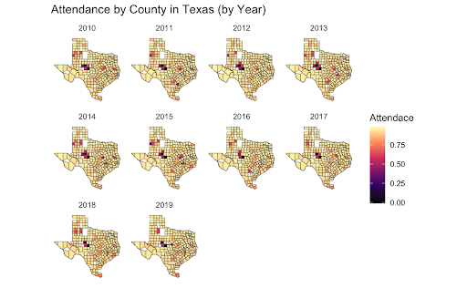
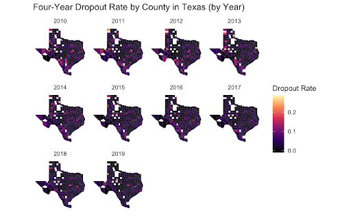
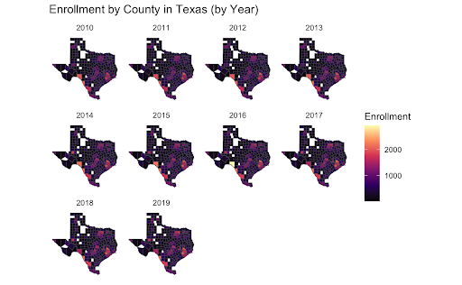
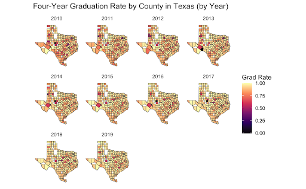
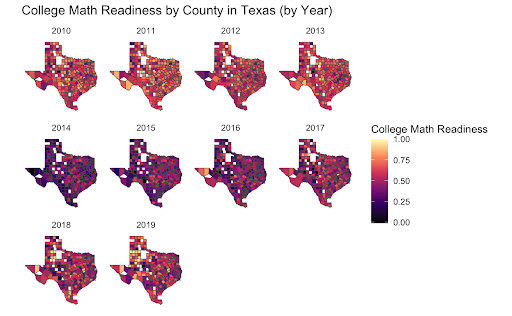
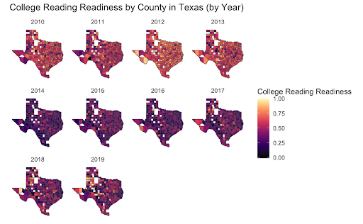

# The Correlation between Median Housing Income and Educational Outcomes in Texas

# 📊 Final Data Visualization Project

## 🔍 What is this GitHub repository all about?

This repository contains the code, data, and supporting files for our final data visualization project, developed using R, Quarto, and a suite of visualization packages. The project explores trends in Texas income and educational data using interactive and animated graphics. The resulting output is a fully rendered data storytelling website created with Quarto.

---

## 🧰 Required Software & Version Numbers

To run the code in this repository, please ensure the following software is installed:

- **R**: version 4.4.3 or later  
- **RStudio**: version 2024.12.1 Build 563 or later  
- **Quarto**: version 1.4.550 or later  
- **R Packages** (install with `install.packages()` or use `renv` if included):
  - `tidyverse`
  - `ggplot2`
  - `gganimate`
  - `plotly`
  - `readr`
  - `sf`
  - `dplyr`
  - `viridis`
  - `gifski`
  - `transformr`

---

## 🛠️ How to Run the Code

1. Clone the repository using Git:
bash
   git clone https://github.com/yourusername/your-repo-name.git
   
2. **Install the dependencies**

install.packages(c("tidyverse", "gganimate", "plotly", "readr", "sf", "viridis", "gifski", "transformr"))

## 🌐 Expected Output
The expected output is a responsive, accessible, and interactive Quarto website. It includes:

Animated maps of annual income shifts in Texas across counties over the span of ten years.

Standardized comparisons of educational data across the state of Texas over ten years.

Color-blind accessible palettes and properly sized plots.

## Screenshots

*Average attendance rates across ten years in Texas by county*

*Average dropout rates across ten years in Texas by county*

*Average enrollment rates across ten years in Texas by county*

*Average graduation rates across ten years in Texas by county*

*Average median household income across the state of Texas over ten years based on census data*

*Average scores per county for math readiness exams in Texas over the ten year span*

*Average scores per county for reading readiness exams in Texas over the ten year span*

